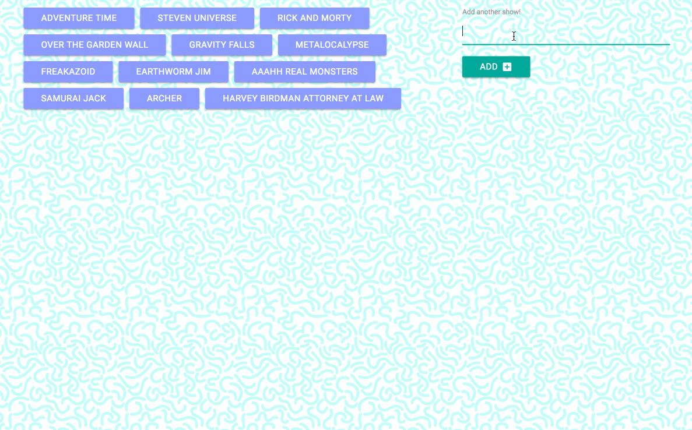

<h1 align="center">GiphyGrabber: Animation!</h1>

Whimisical web application for grabbing themed animated gifs using the Giphy API

## Deployed Application

[GitHub Pages] <https://g33klaura.github.io/GiphyGrabber/>

## Contents

- [Deployed Application](#deployed-application)
- [Contents](#contents)
- [Concept](#concept)
- [Technologies Used](#technologies-used)
- [Key Features](#key-features)
- [Application Process](#application-process)
- [Screenshots](#screenshots)

## Concept

As a die-hard fan of animation, I've selected some of my favorite show titles to display a selection of gifs, using the Giphy API

## Technologies Used

Ajax, jQuery, JavaScript, Giphy API, Materialize framework, CSS, & HTML

## Key Features

- Dynamic rendering with jQuery
- Form for user-generated buttons
- Pause and play gif animations

### Application Process

1. Each button is labeled with an animated show title; when clicked, 10 animated gifs matching the title are rendered
1. The rating of each gif is displayed
1. When initially rendered, each animated gif is paused (static state)
1. Click each gif to animate and again to pause
1. An input form is provided for the user to add their own button with animated title label
1. Each user-added button acts in the same manner as original buttons

### Screenshots

###### Click buttons to render gifs

<!-- *Click buttons to render gifs* -->

###### Use form to generate new button

